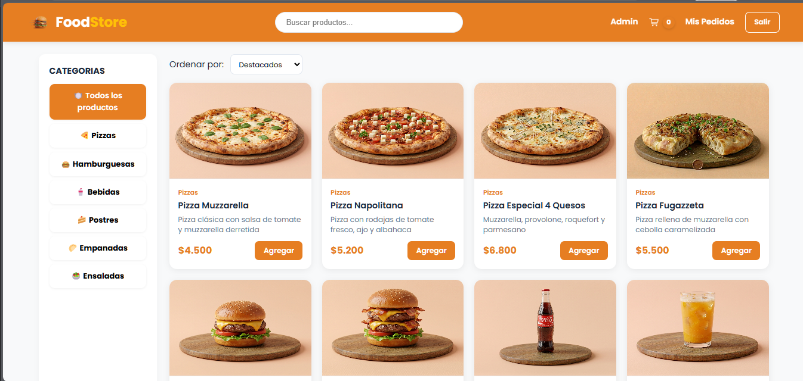

# 🍔 FoodStore - Frontend

Aplicación web desarrollada como <strong>Trabajo Práctico Integrador de Programación III</strong>.

Permite administrar un comercio gastronómico mediante dos perfiles de usuario (Administrador y Cliente), integrando un frontend desarrollado en TypeScript con un backend construido en Spring Boot, consumiendo una API REST y persistiendo la información en una base de datos H2.

---

# 📸 Vista previa de la aplicación
A continuación se muestra la pantalla principal de FoodStore.

<p align="center">

</p>

---

# ✨ Características principales

✔ Registro e inicio de sesión.

✔ Roles de Usuario y Administrador.

✔ Gestión completa de Categorías.

✔ Gestión completa de Productos.

✔ Carrito de compras.

✔ Checkout.

✔ Gestión de Pedidos.

✔ Cambio de estado de pedidos.

✔ Dashboard administrativo.

✔ Persistencia mediante Spring Boot + H2 Database.

✔ API REST completamente integrada.

---

# 🛠 Tecnologías utilizadas

## Frontend
- HTML5
- CSS3
- TypeScript
- Vite

## Backend
- Java
- Spring Boot
- Spring Data JPA
- Hibernate
- H2 Database
- Lombok

# 🚀 Funcionalidades

## 👤 Cliente

- Registro de usuarios.
- Inicio de sesión.
- Catálogo de productos.
- Búsqueda por nombre.
- Filtro por categorías.
- Ordenamiento de productos.
- Carrito de compras.
- Checkout.
- Historial de pedidos.
- Consulta del estado actualizado de los pedidos.

## 👨‍💼 Administrador

- Dashboard con estadísticas.
- Gestión de Categorías (CRUD).
- Gestión de Productos (CRUD).
- Gestión de Pedidos.
- Cambio de estado de pedidos.
- Administración del catálogo.

---

# 🔗 Integración con Backend

La aplicación consume la API REST desarrollada en Spring Boot disponible en:

```text
http://localhost:8080/api
```

Archivo de configuración:

```text
src/utils/api.ts
```

---

# 📡 Endpoints utilizados

```text
POST /api/usuarios/login

POST /api/usuarios/registro

GET /api/productos

GET /api/categorias

POST /api/pedidos

PATCH /api/pedidos/{id}/estado
```

---

# ▶️ Cómo ejecutar

1. Iniciar el Backend Spring Boot.

2. Instalar dependencias:

```bash
npm install
```

3. Ejecutar la aplicación:

```bash
npm run dev
```

4. Abrir la URL indicada por Vite.

---

# 👥 Usuarios de prueba

## Administrador

```text
Email: admin@foodstore.com
Contraseña: 123456
```

## Cliente

```text
Email: juan@mail.com
Contraseña: pass123
```

---


# 🏗 Arquitectura General

```text
Frontend
      │
      ▼
API REST
      │
      ▼
Spring Boot
      │
      ▼
Hibernate + JPA
      │
      ▼
H2 Database
```

---

# 🎥 Video demostración

El funcionamiento completo de la aplicación puede visualizarse en el siguiente enlace:

👉 **https://youtu.be/ZtwxIQq_u5o**


---

# 👩‍💻 Autora

**Marianela Valletto**

Trabajo Práctico Integrador

**Programación III**

**Tecnicatura Universitaria en Programación**

**Universidad Tecnológica Nacional**